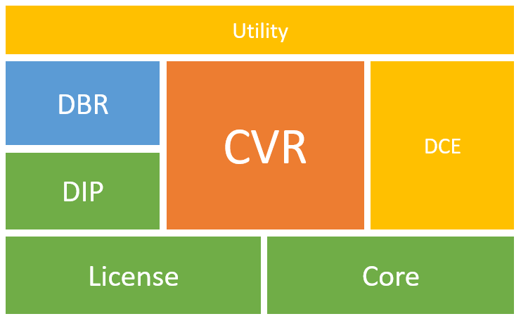

# SDK Overview: Modules and Main APIs

This page provides an overview of the various modules and highlights the most essential APIs that form the backbone of Dynamsoft Barcode Reader SDK.

## Modules Summary

The Dynamsoft Barcode Reader (DBR) SDK is built on the Dynamsoft Capture Vision (DCV) framework, which includes multiple modules working together to achieve barcode reading. The hierarchical structure diagram below illustrates the various modules of the DBR SDK (with modules at the top depending on those below).

    

    
Modules hierarchical of the DBR SDK

The table below describes details the functionalities of these modules:

| Module | Description |
|:-------|:------------|
| `DynamsoftBarcodeReader`(DBR) | The Dynamsoft Barcode Reader module recognizes and decodes multiple barcode formats such as QR codes, Code 39, Code 128, and Data Matrix, among many others. |
| `DynamsoftCore`(Core)  | The Dynamsoft Core module lays the foundation for Dynamsoft SDKs based on the DCV (Dynamsoft Capture Vision) architecture. It encapsulates the basic classes, interfaces, and enumerations shared by these SDKs. |
| `DynamsoftCaptureVisionRouter`(CVR) | The Dynamsoft Capture Vision Router module is the cornerstone of the Dynamsoft Capture Vision (DCV) architecture. It focuses on coordinating batch image processing and provides APIs for setting up image sources and result receivers, configuring workflows with parameters, and controlling processes. |
| `DynamsoftImageProcessing`(DIP) | The Dynamsoft Image Processing module facilitates digital image processing and supports operations for other modules, including the Barcode Reader, Label Recognizer, and Document Normalizer. |
| `DynamsoftLicense`(License) | The Dynamsoft License module manages the licensing aspects of Dynamsoft SDKs based on the DCV (Dynamsoft Capture Vision) architecture. |
| `DynamsoftCameraEnhancer`(DCE) | The Dynamsoft Camera Enhancer module controls the camera, transforming it into an image source for the DCV (Dynamsoft Capture Vision) architecture through ISA implementation. It also enhances image quality during acquisition and provides basic viewers for user interaction. |
| `DynamsoftUtility`(Utility) | The Dynamsoft Utility module defines auxiliary classes, including the ImageManager, and implementations of the CRF (Captured Result Filter) and ISA (Image Source Adapter) . These are shared by all Dynamsoft SDKs based on the DCV (Dynamsoft Capture Vision) architecture. |
| `DynamsoftCodeParser`(DCP) | The Dynamsoft Code Parser module converts data strings, typically encrypted in barcodes and machine-readable zones, into human-readable information. |
| `DynamsoftCodeParserDedicator`(DCPD) | The Dynamsoft Code Parser Dedicator module provides auxiliary functionality to enhance and extend the capabilities of DCP module. |

## Main APIs

### Capture Vision Router

The main class [`CaptureVisionRouter`]({{ site.dcvb_android_api }}capture-vision-router/capture-vision-router.html) acts as the SDK entry point and provides the following essential APIs:

- [Set input]({{ site.dcvb_android_api }}capture-vision-router/multiple-file-processing.html#setinput)
- [Config barcode reader settings]({{ site.dcvb_android_api }}capture-vision-router/settings.html)
- [Add result receiver]({{ site.dcvb_android_api }}capture-vision-router/multiple-file-processing.html#addresultreceiver)
- [Start video stream barcode processing]({{ site.dcvb_android_api }}capture-vision-router/multiple-file-processing.html#startcapturing)

### Image Source Adapter

The [`ImageSourceAdapter`]({{ site.dcvb_android_api }}core/basic-structures/image-source-adapter.html) class is an abstract class representing an adapter for image sources, providing a framework for fetching, buffering, and managing images from various sources. It serves as the input for the [`CaptureVisionRouter`]({{ site.dcvb_android_api }}capture-vision-router/capture-vision-router.html). You can either use the typical implementations of [`ImageSourceAdapter`]({{ site.dcvb_android_api }}core/basic-structures/image-source-adapter.html) or implement your own.

Class [`CameraEnhancer`]({{ site.dce_android }}primary-api/camera-enhancer.html) is one of the typical implementations of [`ImageSourceAdapter`]({{ site.dcvb_android_api }}core/basic-structures/image-source-adapter.html). It is a class that not only implements the video frame obtaining APIs but also enable you to improve the video quality by adjusting the camera settings.

### Captured Result Receiver

To receive the results of video streaming barcode decoding, you need to implement the [`CapturedResultReceiver`]({{ site.dcvb_android_api }}capture-vision-router/auxiliary-classes/captured-result-receiver.html) with the callback method [`onDecodedBarcodesReceived`]({{ site.dcvb_android_api }}capture-vision-router/auxiliary-classes/captured-result-receiver.html#ondecodedbarcodesreceived). The result you received in the callback method is a [`DecodedBarcodesResult`](decoded-barcodes-result.md) object, which contains all the decoded barcodes from the processed video frame.

- [`onDecodedBarcodesReceived`]({{ site.dcvb_android_api }}capture-vision-router/auxiliary-classes/captured-result-receiver.html#ondecodedbarcodesreceived): The callback method for you to receive the barcode decoding results with a [`DecodedBarcodesResult`](decoded-barcodes-result.md) object.
- [`DecodedBarcodesResult`](decoded-barcodes-result.md): An object that contains all the [`BarcodeResultItem`](barcode-result-item.md) that obtained from a video frame.
- [`BarcodeResultItem`](barcode-result-item.md): The basic item that represents a single barcode with the decoded text and other information.

### Camera View

[`CameraView`]({{ site.dce_android }}auxiliary-api/dcecameraview.html) is a view class that design for visualizing the real time video streaming and the barcode decoding result. If the [`CameraEnhancer`]({{ site.dce_android }}primary-api/camera-enhancer.html) is set as the input of your CVR, the decoded barcodes will be highlighted automatically on the [`CameraView`]({{ site.dce_android }}auxiliary-api/dcecameraview.html).
