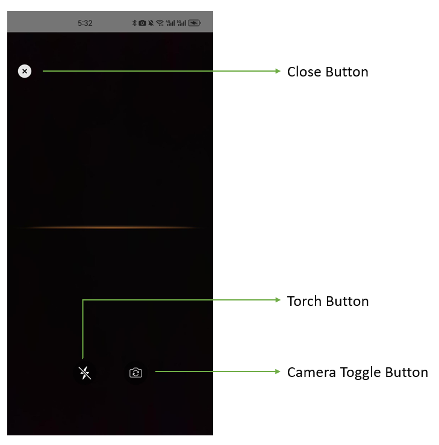

# Configure the UI Elements

| Available Buttons |
| ----------------- |
| Torch button |
| Camera toggle button |
| Close button (BarcodeScanner API only) |

BarcodeScanner provides a set of UI elements that you can easily customize.

<div align="center">
    <p></p>
    <p>Barcode Scanner UI Components</p>
</div>

- Torch button: A clickable button that turns the torch on or off.
- Camera toggle button: A clickable button that switches the front/back-facing camera.
- Close button: Stops barcode scanning and returns to the previous activity.

## Work with BarcodeScanner APIs

<div class="sample-code-prefix"></div>
>- Java
>- Kotlin
>
>1. 
```java
BarcodeScannerConfig config = new BarcodeScannerConfig();
config.setTorchButtonVisible(true);
config.setCloseButtonVisible(true);
config.setCameraToggleButtonVisible(true);
```
2. 
```kotlin
val config = BarcodeScannerConfig().apply {
   torchButtonVisible = true
   closeButtonVisible = true
   cameraToggleButtonVisible = true
}
```

**Related APIs**

- [`BarcodeScannerConfig`]({{ site.dbr_android_api }}barcode-scanner/barcode-scanner-config.html)
  - [setTorchButtonVisible]({{ site.dbr_android_api }}barcode-scanner/barcode-scanner-config.html#settorchbuttonvisible)
  - [setCloseButtonVisible]({{ site.dbr_android_api }}barcode-scanner/barcode-scanner-config.html#setclosebuttonvisible)
  - [setCameraToggleButtonVisible]({{ site.dbr_android_api }}barcode-scanner/barcode-scanner-config.html#setcameratogglebuttonvisible)

## Work with Foundational APIs

<div class="sample-code-prefix"></div>
>- Java
>- Kotlin
>
>1. 
```java
CameraView cameraView = findViewById(R.id.camera_view);
cameraView.setTorchButtonVisible(true);
cameraView.setCameraToggleButtonVisible(true);
```
2. 
```kotlin
val cameraView = findViewById<CameraView>(R.id.camera_view)
cameraView.torchButtonVisible = true
cameraView.cameraToggleButtonVisible = true
```

**Related APIs**

- [`CameraView`]({{ site.dce_android }}auxiliary-api/dcecameraview.html)
  - [setTorchButtonVisible]({{ site.dce_android }}auxiliary-api/dcecameraview.html#settorchbuttonvisible)
  - [setCameraToggleButtonVisible]({{ site.dce_android }}auxiliary-api/dcecameraview.html#setcameratogglebuttonvisible)
