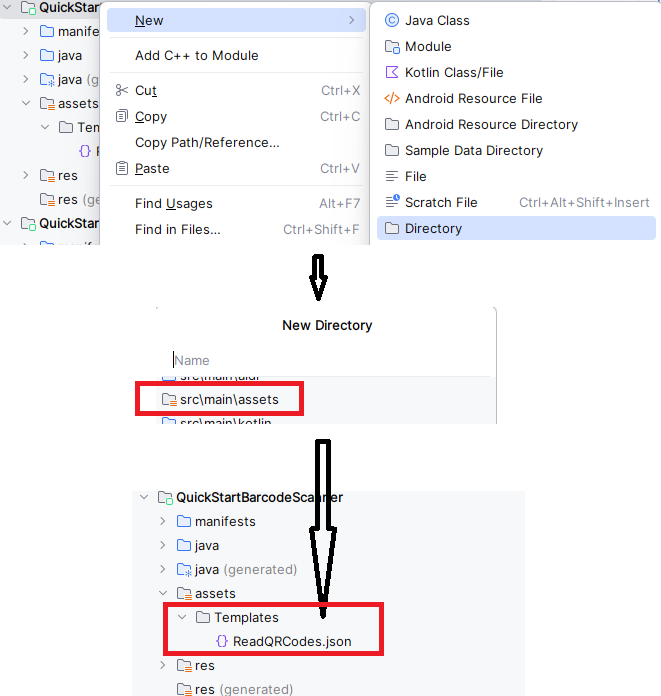

# How to Initialize Customized Templates

Using a template file is one of the quickest ways to improve BarcodeScanner performance. A template file is a JSON file (or JSON string) that contains a set of algorithm parameter settings. [Contact us](https://www.dynamsoft.com/company/customer-service/#contact) to get a customized template for your scanner.

## Preparation

Add a **Templates** folder under your project's assets directory at **src\main\assets\Templates**. Put your JSON file in the **Templates** folder. Here, we use **ReadQRCode.json** as an example.

<div align="left">
    <p></p>
    <p>init settings</p>
</div>

## Initialize with Foundational APIs

<div class="sample-code-prefix"></div>
>- Java
>- Kotlin
>
>1. 
```java
CaptureVisionRouter mRouter = new CaptureVisionRouter();
try {
   mRouter.initSettingsFromFile("ReadQRCodes");
} catch (CaptureVisionRouterException e) {
   throw new RuntimeException(e);
}
```
2. 
```kotlin
val mRouter: CaptureVisionRouter? = CaptureVisionRouter()
mRouter?.initSettingsFromFile("ReadQRCodes")
```

## Initialize with BarcodeScanner APIs

Specify the template file with `setTemplateFile`.

<div class="sample-code-prefix"></div>
>- Java
>- Kotlin
>
>1. 
```java
BarcodeScannerConfig config = new BarcodeScannerConfig();
config.setTemplateFile("ReadQRCodes.json");
```
2. 
```kotlin
val config = BarcodeScannerConfig().apply {
   templateFile = "ReadQRCodes.json"
}
```

**Related APIs**

- [`setTemplateFile`]({{ site.dbr_android_api }}barcode-scanner/barcode-scanner-config.html#settemplatefile)
- [`initSettingsFromFile`]({{ site.dcvb_android_api }}capture-vision-router/settings.html#initsettingsfromfile)
