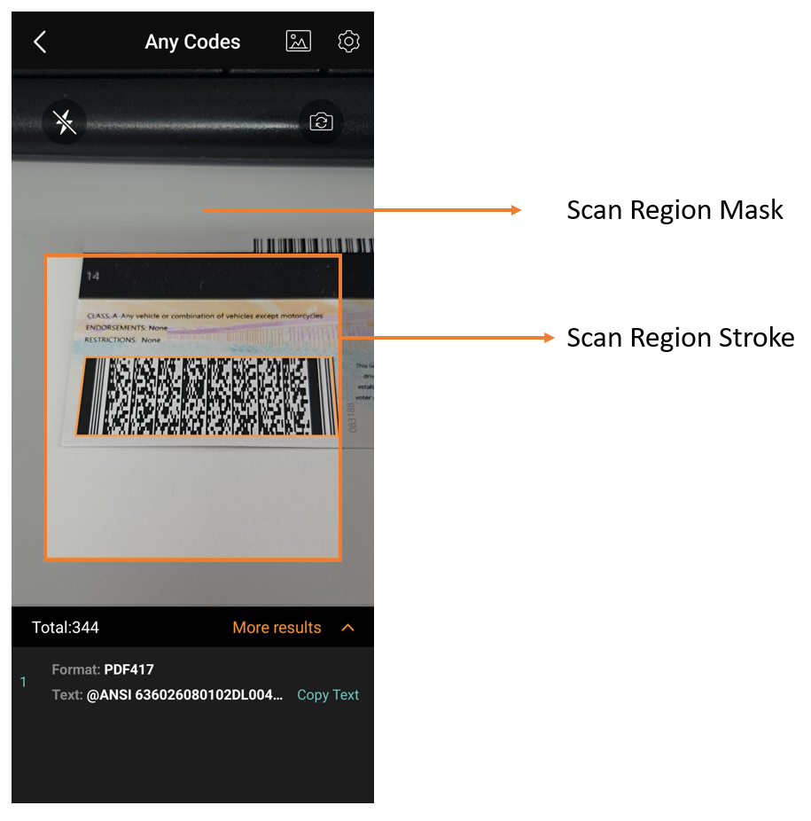

# Configure the Scan Region Style

## Visibility

After you call `setScanRegion`, the scan region is visible by default. You can hide it by calling `setScanRegionMaskVisible`.

<div class="sample-code-prefix"></div>
>- Java
>- Kotlin
>
>1. 
```java
try {
    mCamera.setScanRegion(new DSRect(0.15f, 0.25f, 0.85f, 0.65f, true));
} catch (CameraEnhancerException e) {
    throw new RuntimeException(e);
}
cameraView.setScanRegionMaskVisible(false);
```
2. 
```kotlin
try {
    mCamera.setScanRegion(DSRect(0.15f, 0.25f, 0.85f, 0.65f, true))
} catch (e: CameraEnhancerException) {
    throw RuntimeException(e)
}
cameraView.setScanRegionMaskVisible(false)
```

## Scan Region Mask Style

The scan region mask style includes the stroke color, stroke width, and mask color.

<div align="center">
    <p></p>
    <p>Barcode Scanner UI Components</p>
</div>

<div class="sample-code-prefix"></div>
>- Java
>- Kotlin
>
>1. 
```java
cameraView.setScanRegionMaskStyle(R.color.white, R.color.dy_gray, 2);
```
2. 
```kotlin
cameraView.setScanRegionMaskStyle(R.color.white, R.color.dy_gray, 2)
```

## Laser

The scan laser is a light bar that moves up and down to indicate active scanning. It does not affect performance. It is hidden by default. When a scan region is set, the laser movement is limited to that region.

<div class="sample-code-prefix"></div>
>- Java
>- Kotlin
>
>1. 
```java
cameraView.setScanLaserVisible(true);
```
2. 
```kotlin
cameraView.setScanLaserVisible(true)
```
