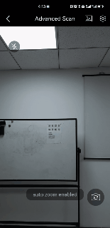

# Zoom Control

Zoom control is commonly used when processing small barcodes or scanning from a long distance. There are two zoom control features:

- Auto-zoom: Lets the library determine whether to zoom in.
- Zoom factor: Lets you set the zoom factor directly. This is commonly used when focusing on small barcodes.

## Auto Zoom

Enable auto-zoom so the camera can zoom in automatically.

<div align="center">
    <p></p>
    <p>Auto Zoom</p>
</div>

### Use BarcodeScanner APIs

<div class="sample-code-prefix"></div>
>- Java
>- Kotlin
>
>1. 
```java
BarcodeScannerConfig config = new BarcodeScannerConfig();
config.setAutoZoomEnabled(true);
```
2. 
```kotlin
val config = BarcodeScannerConfig().apply {
   isAutoZoomEnabled = true
}
```

**Related API**

- [`setAutoZoomEnabled`]({{ site.dbr_android_api }}barcode-scanner/barcode-scanner-config.html#setautozoomenabled)

### Use Foundational APIs

<div class="sample-code-prefix"></div>
>- Java
>- Kotlin
>
>1. 
```java
CameraEnhancer mCamera = new CameraEnhancer(this);
try {
   mCamera.enableEnhancedFeatures(EnumEnhancerFeatures.EF_AUTO_ZOOM);
} catch (CameraEnhancerException e) {
   throw new RuntimeException(e);
}
```
2. 
```kotlin
val mCamera = CameraEnhancer(this)
mCamera.enableEnhancedFeatures(EnumEnhancerFeatures.EF_AUTO_ZOOM)
```

**Related API**

- [`enableEnhancedFeatures`]({{ site.dce_android }}primary-api/camera-enhancer.html#enableenhancedfeatures)

## Zoom Factor

### Use BarcodeScanner APIs

<div class="sample-code-prefix"></div>
>- Java
>- Kotlin
>
>1. 
```java
BarcodeScannerConfig config = new BarcodeScannerConfig();
config.setZoomFactor(2.0f);
```
2. 
```kotlin
val config = BarcodeScannerConfig().apply {
   zoomFactor = 2.0f
}
```

**Related API**

- [`setZoomFactor`]({{ site.dbr_android_api }}barcode-scanner/barcode-scanner-config.html#setzoomfactor)

### Use Foundational APIs

<div class="sample-code-prefix"></div>
>- Java
>- Kotlin
>
>1. 
```java
CameraEnhancer mCamera = new CameraEnhancer(this);
mCamera.setZoomFactor(2.0f);
```
2. 
```kotlin
val mCamera = CameraEnhancer(this)
mCamera.zoomFactor = 2.0f
```

**Related API**

- [`setZoomFactor`]({{ site.dce_android }}primary-api/camera-enhancer.html#setzoomfactor)
