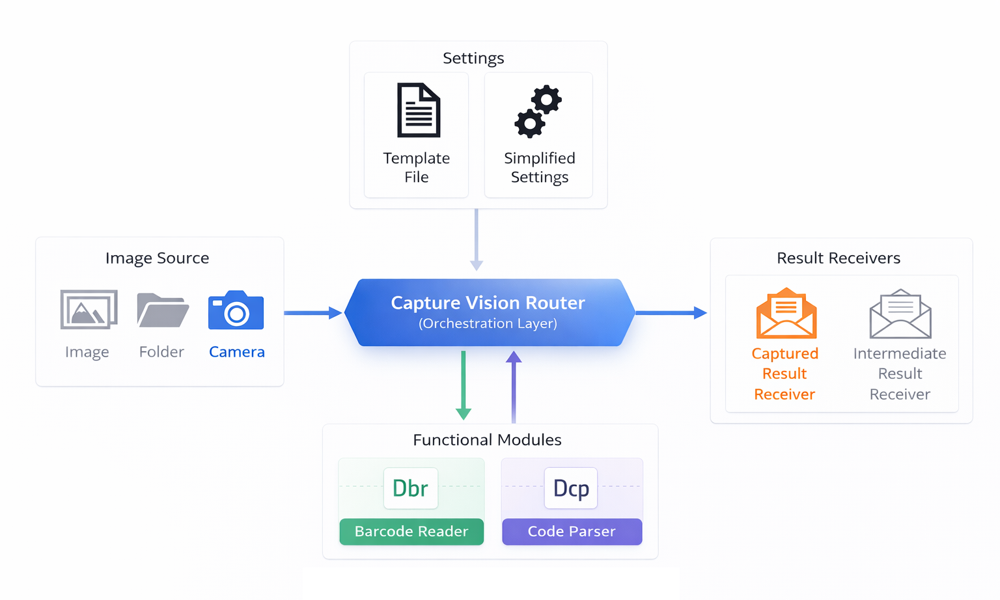

# Core Concepts

This page provides a high-level overview of the underlying architecture and data flow of the Dynamsoft Barcode Reader SDK. Understanding these concepts will help you efficiently configure the SDK for various scanning scenarios.

## Capture Vision Architecture

How CVR coordinate Works

    

- Fetch images from the camera or file folder.
- Load and apply settings (or templates).
- Coordinate tasks and invoke the Functional Modules required for each task.
- Distribute captured results.

## Image Source

`ImageSourceAdapter` is the standard input for Capture Vision architecture. Once the capture process starts, CVR continuously acquires image data from the `ImageSourceAdapter` until the capture process is stopped or the image source is exhausted.

You can directly use the implementations provided by Dynamsoft:

- Camera: `CameraEnhancer`
- File/Directory: `DirectoryFetcher`

You can also create a custom `ImageSourceAdapter`. For example, see [use cameraX to implement ImageSourceAdapter](https://github.com/Dynamsoft/barcode-reader-mobile-samples/tree/main/android/FoundationalAPISamples/DecodeWithCameraX){:target="_blank"}.

## Templates, Settings

For each input image, the tasks to be executed and the algorithms used by each task are controlled by a template. Settings are a commonly used subset of template configuration options.

When starting a capture process, you must specify a valid template name. You can use either a `Preset Template` or a `Customized Template`.

- `Preset Template`: The preset templates for you to quickly access.
- `Customized Template`: If you are not satisfied with the current performance, you can contact us for full customization. You will then receive a customized template.

## Functional Modules

Functional modules are the core components of the product. CVR invokes the required functional modules based on the tasks you configure. The available functional modules include:

- `DynamsoftBarcodeReader`: Reads various types of barcodes. See all [supported barcode formats](../../api-reference/enum/barcode-format.md).
- `DynamsoftCodeParser`: Parses the text content of recognized results, such as driver's licenses and GS1 AI data.

A valid license is required to activate these functional modules.

## Result Receivers

### Standard Output - Captured Results

`CapturedResult` is the standard output of Dynamsoft Capture Vision. It contains all results generated during image processing, including barcode results, parsed results, and other captured data.

`BarcodeResultItem` represents a single detected barcode and contains the complete information for that barcode. If multiple barcodes are recognized in a single scan, the barcode result will contain multiple `BarcodeResultItem` objects.

| Example BarcodeResultItem |  |
| ----------------- | -- |
| `format` | 67108864 |
| `formatString` | QR_CODE |
| `text` | www.dynamsoft.com |
| `bytes` | [119],[119],[119],[46],[100],[121],...... |
| `location` | Point(196, 1101), Point(518, 1000),...... |
| `confidence` | 86 |
| `angle` | 345 |
| `moduleSize` | 10 |
| `isDPM` | FALSE |
| `isMirrored` | FALSE |
| `details` | rows = 2 columns = 2 errorCorrectionLevel = L version = 2 model = 2 mode = 7 page = -1 totalPage = -1 parityData = 0 dataMaskPattern = 2 codewords = ...... |

### Advanced Output - Intermediate Results

From the beginning of image processing to the generation of a `CapturedResult`, the algorithm goes through multiple stages. The output produced at each stage is called an intermediate result.

Intermediate results are useful for the following purposes:

1. Algorithm tuning: By examining intermediate results, you can identify how to optimize the algorithm. For example, you can evaluate barcode region quality in `BinaryImageUnit` to adjust `BinarizationModes`, or inspect `LocalizedBarcodesUnit` to refine `LocalizationModes`.
2. Debugging: By reviewing the output of each stage, you can locate the stage where a problem occurs and determine whether the issue comes from the template configuration or your code.
3. Customization: You can implement custom processing logic based on intermediate results without modifying the SDK itself.

The intermediate results related to barcode decoding include:

| Stage | Intermediate Results | Description |
|-------|----------------------|-------------|
| BinarizeImageStage | `BinaryImageUnit` | The quality of binary image determines the localization accuracy. |
| LocalizeCandidateBarcodesStage | `LocalizedBarcodesUnit` | The localized barcodes. |
| ResistDeformationStage | `DeformationResistedBarcodeImageUnit` | The barcode image processed by `DeformationResistingModes`. |
| ComplementBarcodeStage | `ComplementedBarcodeImageUnit` | The barcode image processed by `BarcodeComplementModes`. |
| ScaleBarcodeImageStage | `ScaledBarcodeImageUnit` | The scaled barcode image processed by `BarcodeScaleModes`. |
| DecodeBarcodesStage | `DecodedBarcodesUnit` | The decoded barcodes. |
