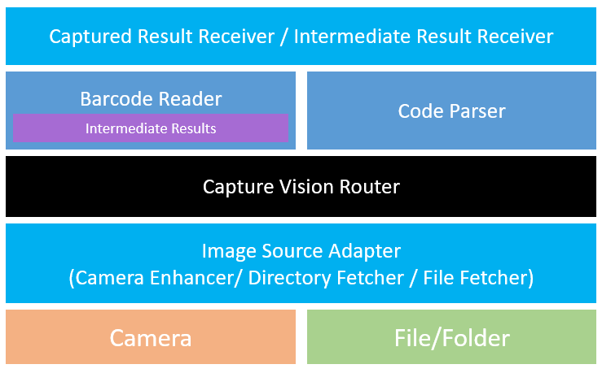
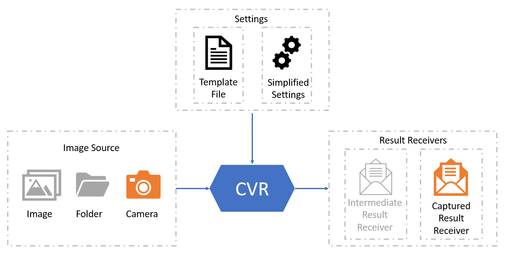

# Architecture of Dynamsoft Capture Vision

Dynamsoft Capture Vision (DCV) is a powerful SDK architecture designed to adapt to a variety of image-processing scenarios, enabling the extraction of useful information from images. Its structure accommodates both entry-level needs and sophisticated business logic. The design allows developers to quickly build conceptual prototypes within minutes while also supporting complex customizations for more demanding tasks. In this article, we'll take a deep dive into the DCV architecture that makes this flexibility possible.

## Router - Capture Vision Router (CVR)

`CaptureVisionRouter` is the active coordinator in the DCV architecture. The other modules are mostly passive: they do not pull images or run on their own, but wait for CVR to invoke them as part of a capture workflow.

In practice, CVR is responsible for:

- Accepting images from a configured input source.
- Loading and applying templates or simplified settings.
- Scheduling one or more recognition or parsing tasks.
- Returning standard results and optional intermediate results to registered receivers.

### Templates & Settings

- `Templates`: JSON objects for algorithm parameter customization.
  - `Preset Template`: The preset templates for you to quickly access.
  - `Customized Template`: If you are not satisfied with the current performance, you can contact us for full customization. You will then receive a customized template.
- `Settings`: A subset of Template parameters that can be quickly accessed via APIs.

---------------

## Input

The standard input abstraction in DCV is `ImageSourceAdapter` (ISA). CVR does not depend on a specific camera or file source. As long as the source follows the ISA contract, CVR can consume it.

This is important because it keeps image acquisition decoupled from recognition. You can start with a built-in input source, or work with your own source without changing the recognition pipeline.

Common input choices include:

- `CameraEnhancer` for scanning from a live camera preview.
- `DirectoryFetcher` for processing images from a folder or batch source.

For most Android apps, `CameraEnhancer` is the default choice because it already integrates camera control, preview, and image enhancement. This is also the setup used in [Build your APP with Foundational APIs](../../foundational-guide.md).

---------------

## Functional modules

- **Dynamsoft Barcode Reader (DBR)**
- **Dynamsoft Code Parser (DCP)**

Functional modules are the execution units in DCV. They do not actively pull images or schedule work by themselves. Instead, they execute a series of tasks arranged by CVR in the selected workflow.

The functional modules in this architecture are:

- **DBR (Dynamsoft Barcode Reader)**: Detects and decodes barcodes from images or video frames.
- **DCP (Dynamsoft Code Parser)**: Parses supported encoded strings into structured, human-readable data.

---------------

## Output - Result Receivers

- Captured Result Receiver
- Intermediate Result Receiver

CVR exposes results through receiver interfaces instead of returning only a single final object. This makes the output side as flexible as the input side.

### Captured Result Receiver

`CapturedResultReceiver` is the standard API for receiving capture results from CVR. In a normal workflow, this is the primary receiver used by the application to obtain the results produced by the configured functional modules.

For example, results returned through `CapturedResultReceiver` can include:

- Barcode results produced by DBR.
- Parsed results produced by DCP.
- Original images.

In other words, `CapturedResultReceiver` is the standard place to receive the main output of the DCV workflow.

### Intermediate Result Receiver

Before a final `CapturedResult` is produced, the algorithm processes the image through a large number of stages. Each stage completes a specific part of the workflow and may generate its own output. These outputs are the intermediate results.

If the output of `CapturedResult` marks the end of processing for the entire image, then the output of an intermediate result marks the end of the corresponding stage. Because intermediate results are produced in real time as the workflow advances, users can inspect the output of a stage, modify it if needed, and let that change affect the final `CapturedResult`.

`IntermediateResultReceiver` is the API used to receive these stage-level results. It is mainly used in advanced scenarios where you need visibility into the internal stages or want to introduce additional logic into the processing flow.

Use it when you want to:

- Trace and observe the result of each stage when troubleshooting recognition issues.
- Manually intervene in the processing flow and introduce extra logic to improve the recognition result.
- Obtain additional information that is not available through `CapturedResultReceiver`.

If you mainly care about the standard outputs of the workflow, `CapturedResultReceiver` is usually enough. If you need more processing-stage data, combine it with intermediate results. Related topics:

- [Understanding Barcode Results](understand-barcode-results.md)
- [Get Original Image](../capabilities/get-original-image.md)

---------------

## Next Steps

- Read [Parameters, Settings & Templates](parameters-and-templates.md) to understand how workflows are configured.
- Read [Understanding Barcode Results](understand-barcode-results.md) to understand what CVR returns.
- Read [Build your APP with Foundational APIs](../../foundational-guide.md) to see this architecture mapped to Android code.
- Read [Configure Simplified Settings](../capabilities/config-simplified-settings.md) or [Initialize Customized Templates](../capabilities/init-customized-template.md) when you are ready to customize the pipeline.

---------------
