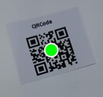

# Understanding Barcode Scan Results

`BarcodeScanResult` is the object returned by the `onScanResult` callback when a scanning session finishes, is canceled, or encounters an error. Every `BarcodeScanResult` contains a `resultStatus` and a list of barcodes.
The barcode list is non-empty only when `resultStatus` is `RS_FINISHED`.

```java
launcher = registerForActivityResult(
	new BarcodeScannerActivity.ResultContract(),
	result -> {
		// User code for using the the scan result.
	}
);
```

## How to Use

### Check Status and Error Messages

Always check `resultStatus` before accessing the decoded barcodes.

- `RS_FINISHED`: Scanning completed successfully. At least one barcode is available.
- `RS_CANCELED` / `RS_EXCEPTION`: No barcodes are returned.

`RS_EXCEPTION` might be caused by:

- You configured an invalid or expired license via `setLicense`.
- You configured an invalid template via `setTemplateFile`.

### Access decoded barcodes

Each decoded barcode is a `BarcodeResultItem` from `result.getBarcodes()`. The following is an example of a `BarcodeResultItem`:



| BarcodeResultItem |  |
| ----------------- | -- |
| `format` | 67108864 |
| `formatString` | QR_CODE |
| `text` | www.dynamsoft.com |
| `bytes` | [119],[119],[119],[46],[100],[121],...... |
| `location` | Point(196, 1101), Point(518, 1000),...... |
| `confidence` | 86 |
| `angle` | 345 |
| `moduleSize` | 10 |
| `isDPM` | FALSE |
| `isMirrored` | FALSE |
| `details` | rows = 2<br>columns = 2<br>errorCorrectionLevel = L<br>version = 2<br>model = 2<br>mode = 7<br>page = -1<br>totalPage = -1<br>parityData = 0<br>dataMaskPattern = 2<br>codewords = ...... |

### Common fields to use

- `text`: The decoded string. This is the most common field used for downstream processing.
- `formatString`: The barcode symbology (for example, `QR_CODE`, `EAN_13`).
- `bytes`: Raw bytes of the barcode payload. By default, barcode text is interpreted using ISO-8859-1. Use this field when the payload contains binary data or requires custom decoding.
- `location`: Corner points of the barcode in the image, useful for drawing overlays.
- `confidence`: A confidence score. Higher values indicate more reliable decoding.
- `details`: Symbology-specific details (varies by barcode type).

## Explore Result Details

This page provides a high-level overview of barcode scan results.  
For more detailed usage and advanced scenarios, see the following topics:

- [Get barcode confidence and rotation]({{ site.features }}get-confidence-rotation.html?lang=android)
- [Get barcode location]({{ site.features }}get-barcode-location.html?lang=android)
- [Get detailed barcode information]({{ site.features }}get-detailed-info.html?lang=android)
- [Filter and sort decoding results]({{ site.features }}filter-and-sort.html?lang=android)
