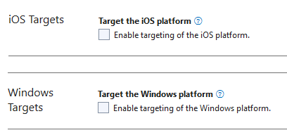

# MAUI User Guide for Barcode Reader Integration

## Table of Contents

- [MAUI User Guide for Barcode Reader Integration](#maui-user-guide-for-barcode-reader-integration)
  - [Table of Contents](#table-of-contents)
  - [System Requirements](#system-requirements)
    - [.Net](#net)
    - [Android](#android)
    - [iOS](#ios)
  - [Installation](#installation)
    - [VS Code](#vs-code)
    - [Visual Studio for Windows](#visual-studio-for-windows)
  - [Build Your Barcode Scanner App](#build-your-barcode-scanner-app)
    - [Set up Development Environment](#set-up-development-environment)
    - [Initialize the Project](#initialize-the-project)
      - [Visual Studio](#visual-studio)
      - [VS Code for iOS](#vs-code-for-ios)
    - [Include the Library](#include-the-library)
    - [Add Your Code for Barcode Scanning](#add-your-code-for-barcode-scanning)
    - [Configure the Camera Permission](#configure-the-camera-permission)
    - [Run the Project](#run-the-project)
  - [Licensing](#licensing)

## System Requirements

### .Net

- .NET 10.0.

### Android

- Supported OS: **Android 5.0** (API Level 21) or higher.
- Supported ABI: **armeabi-v7a**, **arm64-v8a**, **x86** and **x86_64**.
- Development Environment: Visual Studio 2022 or VS Code with the [.NET MAUI extension](https://marketplace.visualstudio.com/items?itemName=ms-dotnettools.dotnet-maui) recommended.
- JDK: 1.8+

### iOS

- Supported OS: **iOS 13.0** or higher.
- Supported ABI: **arm64** and **x86_64**.
- Development Environment: VS Code with the [.NET MAUI extension](https://marketplace.visualstudio.com/items?itemName=ms-dotnettools.dotnet-maui) and latest Xcode version recommended.

## Installation

### VS Code

After [creating the project](#vs-code-for-ios), open a terminal in the project directory and run:

```bash
dotnet add package Dynamsoft.BarcodeReaderBundle.Maui --version 11.4.3000
```

### Visual Studio for Windows

You need to add the library via the project file and complete additional steps for the installation.

1. Add the library in the project file:

    ```xml
    <Project Sdk="Microsoft.NET.Sdk">
        ...
        <ItemGroup>
            ...
            <PackageReference Include="Dynamsoft.BarcodeReaderBundle.Maui" Version="11.4.3000" />
        </ItemGroup>
    </Project>
    ```

2. Open the **Package Manager Console** and run the following commands:

    ```bash
    dotnet build
    ```

<div class="blockquote-note"></div>
>
> - Windows system have a limitation of 260 characters in the path. If you don't use console to install the package, you will receive error "Could not find a part of the path 'C:\Users\admin\.nuget\packages\dynamsoft.imageprocessing.ios\2.4.300\lib\net7.0-ios16.1\Dynamsoft.ImageProcessing.iOS.resources\DynamsoftImageProcessing.xcframework\ios-arm64\dSYMs\DynamsoftImageProcessing.framework.dSYM\Contents\Resources\DWARF\DynamsoftImageProcessing'"
> - The library only support Android & iOS platform. Be sure that you remove the other platforms like Windows, maccatalyst, etc.

## Build Your Barcode Scanner App

Now you will learn how to create a simple barcode scanner using Dynamsoft Barcode Reader MAUI SDK.

### Set up Development Environment

If you are a beginner with MAUI, please follow the guide on the <a href="https://learn.microsoft.com/en-us/dotnet/maui/get-started/installation" target="_blank">.Net MAUI official website</a> to set up the development environment.

### Initialize the Project

#### Visual Studio

1. Open the Visual Studio and select **Create a new project**.
2. Select **.Net MAUI App** and click **Next**.
3. Name the project **ScanBarcodes**. Select a location for the project and click **Next**.
4. Select **.Net 10.0** and click **Create**.

#### VS Code for iOS

1. Open a terminal and run the following command to create a new .NET MAUI project:

   ```bash
   dotnet new maui -n ScanBarcodes
   cd ScanBarcodes
   ```

2. Open the project in VS Code:

   ```bash
   code .
   ```

### Include the Library

View the [installation section](#installation) on how to add the library.

### Add Your Code for Barcode Scanning

1. Replace the **MainPage.xaml.cs** with the following code:

   ```csharp
   using Dynamsoft.BarcodeReaderBundle.Maui;
   
   namespace ScanBarcodes;
   public partial class MainPage : ContentPage
   {
   	public MainPage()
   	{
   		InitializeComponent();
   	}
   
   	private async void OnScanBarcode(object sender, EventArgs e)
       {
   		// Initialize the license.
           // The license string here is a trial license. Note that network connection is required for this license to work.
           // You can request an extension via the following link: https://www.dynamsoft.com/customer/license/trialLicense?product=dbr&utm_source=samples&package=mobile
           var config = new BarcodeScannerConfig("DLS2eyJvcmdhbml6YXRpb25JRCI6IjIwMDAwMSJ9");
           var result = await BarcodeScanner.Start(config);
           var message = result.ResultStatus switch
           {
               EnumResultStatus.Finished => string.Join("\n",
                   result.Barcodes!.Select(item => item.FormatString + "\n" + item.Text)),
               EnumResultStatus.Canceled => "Scanning canceled",
               EnumResultStatus.Exception => result.ErrorString,
               _ => throw new ArgumentOutOfRangeException()
           };
   		label.Text = message;
       }
   }
   ```

2. Replace the **MainPage.xaml** with the following code:

   ```xml
   <?xml version="1.0" encoding="utf-8" ?>
   <ContentPage xmlns="http://schemas.microsoft.com/dotnet/2021/maui"
                xmlns:x="http://schemas.microsoft.com/winfx/2009/xaml"
                x:Class="ScanBarcodes.MainPage">
   
       <Grid>
           <Grid.RowDefinitions>
               <RowDefinition Height="*" />
               <RowDefinition Height="Auto" />
               <RowDefinition Height="*" />
           </Grid.RowDefinitions>
   
           <Label
               Grid.Row="1"
               x:Name="label"
               Text="Click button to Scan a Barcode"
               Style="{StaticResource SubHeadline}"
               SemanticProperties.HeadingLevel="Level2"
               SemanticProperties.Description="Click button to Scan a Barcode"
               HorizontalOptions="Center"
               VerticalOptions="Center" />
   
           <Button
               Grid.Row="2"
               x:Name="ScanBtn"
               Text="Scan a Barcode"
               SemanticProperties.Hint="Click button to Scan a Barcode"
               Clicked="OnScanBarcode"
               HorizontalOptions="Center"
               VerticalOptions="Start"
               Margin="0,30" />
       </Grid>
   </ContentPage>
   ```

### Configure the Camera Permission

Open the **Info.plist** file under the **Platforms/iOS/** folder (Open with XML Text Editor). Add the following lines inside the `<dict>` element to request camera permission on iOS platform:

```xml
<key>NSCameraUsageDescription</key>
<string>The sample needs to access your camera.</string>
```

### Run the Project

**Visual Studio**: Select your target device in the toolbar and click **Run**.

**VS Code**: Use the **.NET MAUI** extension's device picker in the status bar to select a target device, then press **F5** to build and deploy. Alternatively, run from the terminal:

```bash
# Android
dotnet build -t:Run -f net10.0-android

# iOS (requires a connected device or simulator on macOS)
dotnet build -t:Run -f net10.0-ios
```

<div class="blockquote-note"></div>
> The library only supports the **Android** and **iOS** platforms. If you encounter build errors caused by other target frameworks, remove the unsupported platforms:
>
> - **Visual Studio**: Manually exclude the iOS and Windows targets from the build configuration toolbar.
> - **VS Code / CLI**: Open the `.csproj` file and remove the platforms you do not need from the `<TargetFrameworks>` element, for example:
>
>   ```xml
>   <!-- Before -->
>   <TargetFrameworks>net10.0-android;net10.0-ios;net10.0-maccatalyst;net10.0-windows10.0.19041.0</TargetFrameworks>
>
>   <!-- After (Android only) -->
>   <TargetFrameworks>net10.0-android</TargetFrameworks>
>   ```



## Licensing

- A one-day trial license is available by default for every new device to try Dynamsoft Barcode Reader SDK.
- You can request a 30-day trial license via the [Request a Trial License](https://www.dynamsoft.com/customer/license/trialLicense?product=dbr&package=mobile&utm_source=docs){:target="_blank"} link.
- [Contact us](https://www.dynamsoft.com/company/contact/){:target="_blank"} to purchase a full license.
