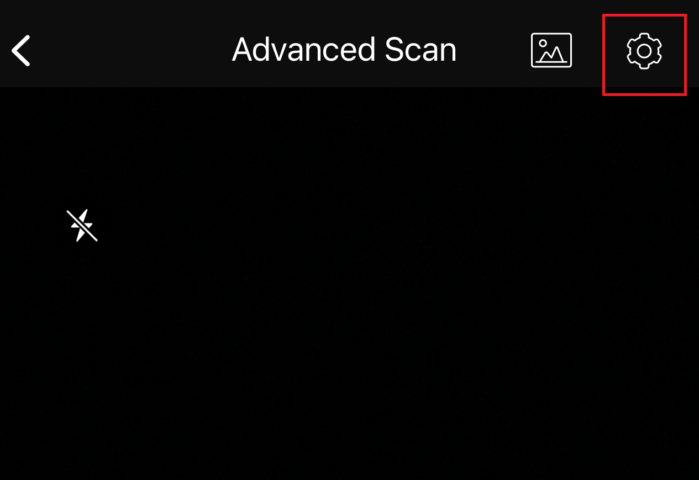
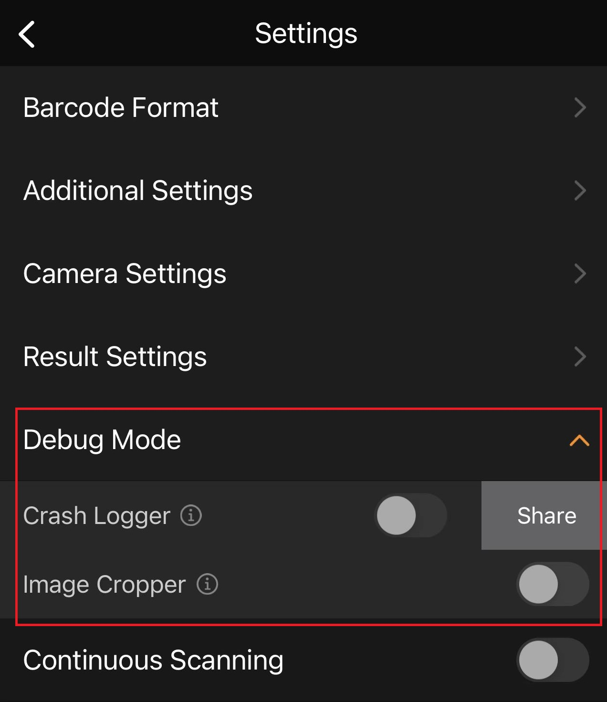
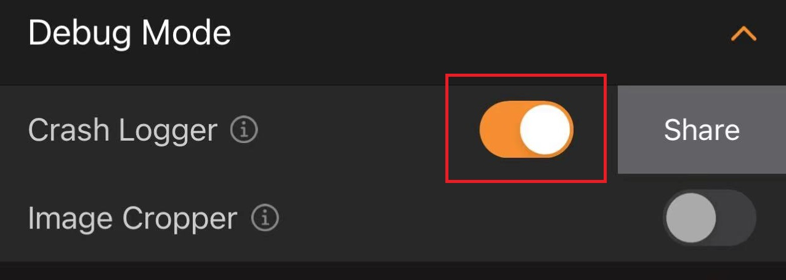
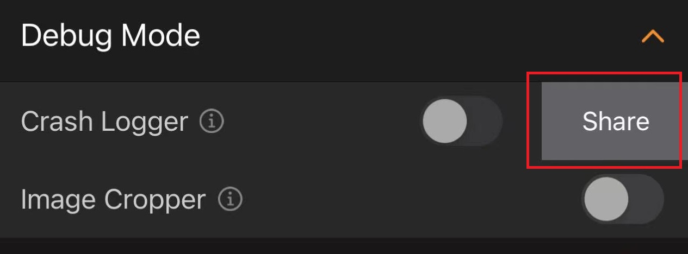

# How to use debug mode in BarcodeScannerX?

[<< Back to FAQ index](index.md)

## Debug Mode in BarcodeScannerX

If you encountered an app crash or had trouble reading barcodes, the [Dynamsoft support team](https://www.dynamsoft.com/company/contact/?ver=latest) might ask you to take advantage of Debug Mode in [BarcodeScannerX](https://www.dynamsoft.com/barcode-reader/sdk-mobile/#appDemo).

1. From the home screen, go to Advanced Scan.

2. Tap the settings icon at the top-right corner.

3. Tap Debug Mode to see the drop-down list.

## Debug Mode - Crash Logger

If you are encountering an app crash caused by Dynamsoft Barcode Reader or Dynamsoft Camera Enhancer SDK, you need Crash Logger.

1. Toggle on Crash Logger

2. After Crash Logger is toggled on, please go ahead and scan codes until you reproduce the crash issue.

3. After the app crashed, reopen BarcodeScannerX app and go to Adanced Scan -> settings. Tap the "Share" button to share the log files with the [Dynamsoft support team](https://www.dynamsoft.com/company/contact/?ver=latest).

## Debug Mode - Image Cropper

If you are having trouble reading codes, here are the trouble shooting steps:

1. Toggle on Image Cropper

2. After Image Cropper is toggled on, an image crop icon will show up at the bottom left of Adanced Scan

3. Tap the image crop icon to crop and share the original images with the [Dynamsoft support team](https://www.dynamsoft.com/company/contact/?ver=latest).
