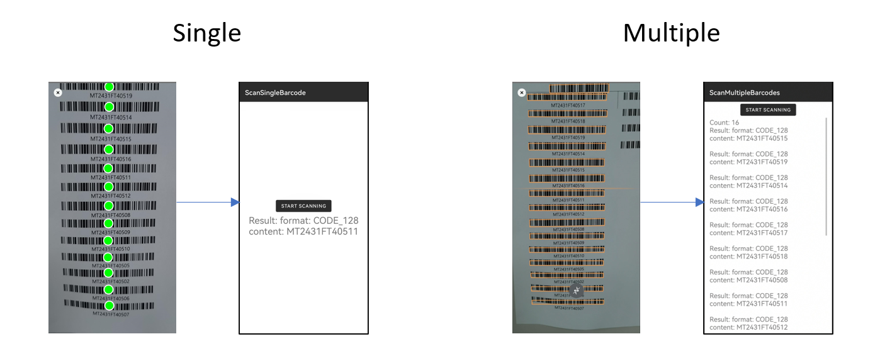

# Dynamsoft Barcode Reader iOS Edition

Dynamsoft Barcode Reader (DBR) SDK iOS Edition is a barcode reading tool designed specifically for iOS developers.

You can either get a quick start with the [BarcodeScanner APIs](api-reference/barcode-scanner/index.md) or experience a highly customizable development with the [foundational APIs](api-reference/index.md). Furthermore, DBR provides a powerful [parameter]({{ site.dcvb_parameters}}file/index.html?lang=objc,swift) system in order to cope with various scenarios.

|    | Develop with BarcodeScanner APIs | Develop with Foundational APIs |
| -- | ------------------------------ | ------------------------------ |
| Lines of Code | 15+ lines | 60+ lines |
| UI | Preset | Fully customizable |
| Decode from Live Video | ✔ | ✔ |
| Decode from an Image | X | ✔ |
| Performance Customization | ✔ | ✔ |
| Camera Control | Limited | ✔ |
| Intermediate Results | X | ✔ |

## Develop with BarcodeScanner APIs

`BarcodeScanner` is a component with the following features:

- Minimal Code: High-level APIs achieve full functionality with one line of code.
- Ready-to-Use UI: Pre-integrated components and UI enable quick setup.
- Common Customization: Configuration objects simplify typical algorithm and UI setups.

`BarcodeScanner` supports 2 different Scanning Modes

- Single Barcode Scanning Mode
  1. Scans any number of barcodes but returns only one result.
  2. Speed prioritized.
  3. Requires user to select one as the result when scanned multiple barcodes.
- Multiple Barcodes Scanning Mode
  1. Scans multiple barcodes and returns all scanned results.
  2. Read-rate prioritized.

    

> If you are looking for a solution to scan large batches of barcodes, please refer to the [`BatchBarcodeScanner`](https://www.dynamsoft.com/use-cases/batch-barcode-scanning/){:target="_blank"}. The `BatchBarcodeScanner` has much higher ability on scanning large number of barcodes. It also provides you a highly interactable UI for result previewing, editing, saving, reusing and sharing.

- [Build your First APP](user-guide.md)
- [Configure your Barcode Scanner](user-guide/configure-barcode-scanner.md)
- [View BarcodeScanner API References](./api-reference/barcode-scanner/index.md)
- [Check out BarcodeScanner Samples on GitHub](https://github.com/Dynamsoft/barcode-reader-mobile-samples/tree/main/ios/BarcodeScannerAPISamples)

## Develop with Foundational APIs

If you are looking for a fully customizable barcode decoding library, you are welcome to use the Foundational APIs.

- [Build your APP with foundational APIs](foundational-guide.md)
- [Explore Features](user-guide/explore-features/index.md)
- [View Foundation API References](./api-reference/index.md)
- [Check out Foundational API Samples on GitHub](https://github.com/Dynamsoft/barcode-reader-mobile-samples/tree/main/ios/FoundationalAPISamples)

## System Requirements

- Supported OS: iOS 13+.
- Supported ABI: arm64 and x86_64.
- Development Environment: Xcode 13+ (Xcode 14.1+ recommended).

## Download Demo App

- [View in App Store](https://apps.apple.com/us/app/dynamsoft-barcode-scanner-demo/id1120581630){:target="_blank"}

## Release Notes

- [Version 11.x](release-notes/ios-11.html)
- [Version 10.x](release-notes/ios-10.html)
- [Version 9.x](release-notes/ios-9.html)
- [Version 8.x](release-notes/ios-8.html)
- [Version 7.6 and below](release-notes/ios-7.html)

## Upgrade Instructions

- [How to upgrade](upgrade.md)

## License Subscription

To develop and run your application with Dynamsoft Barcode Reader SDK, you need an active license key:

- [Request a 30-day free trial license](https://www.dynamsoft.com/customer/license/trialLicense?utm_source=docs&product=dbr&package=ios){:target="_blank"}

## Online Store

- [Online store](https://www.dynamsoft.com/store/dynamsoft-barcode-reader/#mobile){:target="_blank"}

## Contact Us

Feel free to [contact us](https://www.dynamsoft.com/company/customer-service/#contact){:target="_blank"} if you have any questions.
