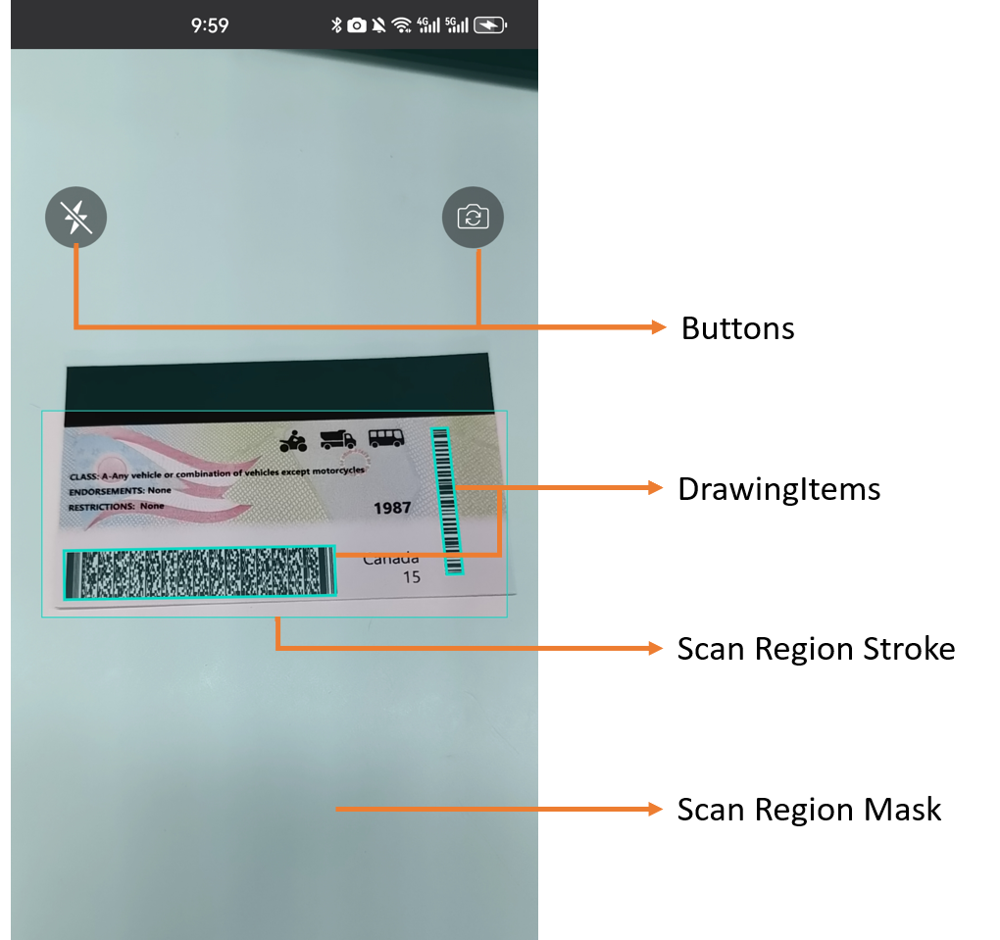

# Customize Your UI

| Customizable UI Elements | Descriptions |
| ------------------------ | ------------ |
| [Torch button](add-functional-buttons.md) | The button for you to turn on/off the torch. |
| [Camera toggle button](add-functional-buttons.md) | The button for you to switch between front/back-facing cameras. |
| [Close button](add-functional-buttons.md) (BarcodeScanner API only) | The button for you to manually close the BarcodeScanner. |
| [Scan Region stroke](scan-region-style.md) | The boundary of the scan region. |
| [Scan Region Mask](scan-region-style.md) | The mask outside the scan region. |
| [Graphics (DrawingItems)](add-graphics.md) | Quadrilateral, rectangle, arc, etc. |

    

    
Customizable UI Elements

