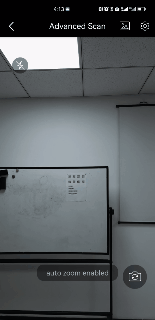

# Zoom Control

Zoom control is commonly used when processing small barcodes or scanning from a long distance. There are two zoom control features:

- Auto-zoom: Lets the library determine whether to zoom in.
- Zoom factor: Lets you set the zoom factor directly. This is commonly used when focusing on small barcodes.

## Auto Zoom

Enable auto-zoom so the camera can zoom in automatically.

<div align="center">
    <p></p>
    <p>Auto Zoom</p>
</div>

<div class="sample-code-prefix"></div>
>- Objective-C
>- Swift
>
>1. 
```objc
[self.dce enableEnhancedFeatures:DSEnhancedFeaturesAutoZoom];
```
2. 
```swift
dce.enableEnhancedFeatures(EnhancedFeatures.autoZoom)
```

**Related API**

- [`enableEnhancedFeatures`]({{ site.dce_ios }}primary-api/camera-enhancer.html#enableenhancedfeatures)


## Zoom Factor

<div class="sample-code-prefix"></div>
>- Objective-C
>- Swift
>
>1. 
```objc
[self.dce setZoomFactor:2.0];
```
2. 
```swift
dce.setZoomFactor(2.0)
```

**Related API**

- [`setZoomFactor`]({{ site.dce_ios }}primary-api/camera-enhancer.html#setzoomfactor)
