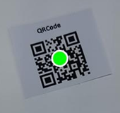

# Understanding Barcode Results

`DecodedBarcodesResult` is the barcode result type returned by the Dynamsoft Barcode Reader SDK. It represents all barcode-related information captured from a single image or video frame.

It contains:

- All decoded barcodes.
- Metadata about the original image.
- Error information when a failure occurs.
- A rotation transformation matrix if the original image includes rotation information.

## How to Use

### Check Error Messages

Error messages are typically caused by:

- The barcode reading task is not working properly.
- The operation times out.

> [!Note]
> You might still receive barcode results even when the error message is not empty.

### Access Decoded Barcodes

Each decoded barcode is a `BarcodeResultItem` from `result.getBarcodes`. Common fields of a `BarcodeResultItem` include:

- `text`: The decoded string. This is the most common field used for downstream processing.
- `formatString`: The barcode symbology (for example, `QR_CODE`, `EAN_13`).
- `bytes`: Raw payload bytes. By default, barcode text is interpreted using ISO-8859-1. Use this when the payload contains binary data or requires custom decoding.
- `location`: Corner points of the barcode in the image, useful for drawing overlays.
- `confidence`: A confidence score. Higher values indicate more reliable decoding.
- `details`: Symbology-specific details (varies by barcode type).

For example:

| Example BarcodeResultItem |  |
| ----------------- | -- |
| `format` | 67108864 |
| `formatString` | QR_CODE |
| `text` | www.dynamsoft.com |
| `bytes` | [119],[119],[119],[46],[100],[121],...... |
| `location` | Point(196, 1101), Point(518, 1000),...... |
| `confidence` | 86 |
| `angle` | 345 |
| `moduleSize` | 10 |
| `isDPM` | FALSE |
| `isMirrored` | FALSE |
| `details` | rows = 2 columns = 2 errorCorrectionLevel = L version = 2 model = 2 mode = 7 page = -1 totalPage = -1 parityData = 0 dataMaskPattern = 2 codewords = ...... |

### Access the Original Image

The original image is not returned by default. To get the original image, you have 2 options:

- (Highly recommended) Get the original image from `IntermediateResultManager` with the `HashId`.
- Let the library to automatically output original image by setting `OutputOriginalImage` parameter.

Read [How to get original image](../capabilities/get-original-image.md) for more details.

### Explore Result Details

This page provides a high-level overview of barcode scan results. For detailed usage and advanced scenarios, see:

- [Get barcode confidence and rotation]({{ site.features }}get-confidence-rotation.html?lang=objc,swift)
- [Get barcode location]({{ site.features }}get-barcode-location.html?lang=objc,swift)
- [Get detailed barcode information]({{ site.features }}get-detailed-info.html?lang=objc,swift)
- [Filter and sort decoding results]({{ site.features }}filter-and-sort.html?lang=objc,swift)
